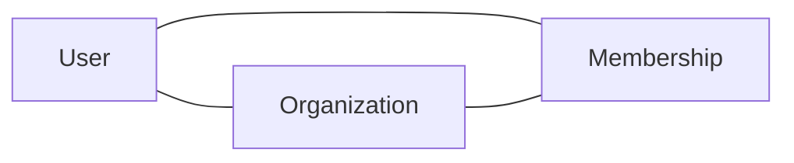

Esta página documenta as principais entidades de domínio. Para definições de schema, veja os arquivos de migração no repo da Core API.

## Entidades centrais

### User

Representa uma pessoa autenticada. Um user pode pertencer a várias organizations.

| Campo | Tipo | Descrição |
|-------|------|-----------|
| `id` | UUID | Chave primária |
| `email` | string | Único, usado para login |
| `created_at` | timestamp | Momento de criação da conta |
| `last_login_at` | timestamp | Última autenticação bem-sucedida |

### Organization

Conta de empresa ou time. É a fronteira primária de billing e de controle de acesso.

| Campo | Tipo | Descrição |
|-------|------|-----------|
| `id` | UUID | Chave primária |
| `name` | string | Nome de exibição |
| `plan` | enum | `free`, `pro`, `enterprise` |
| `owner_id` | FK → User | Dono do billing |

### Membership

Tabela de junção que liga users a organizations com um papel.

| Campo | Tipo | Descrição |
|-------|------|-----------|
| `user_id` | FK → User | |
| `org_id` | FK → Organization | |
| `role` | enum | `owner`, `admin`, `member` |
| `joined_at` | timestamp | |

## Relacionamentos

Um user pode ser membro de várias organizations. Uma organization pode ter vários membros. A tabela `Membership` guarda o papel de cada par.

## Armazenamento de dados

| Tipo de dado | Armazenamento | Notas |
|--------------|---------------|-------|
| Dados relacionais | Postgres | Store primário, via Core API |
| Sessões | Redis | Baseadas em TTL, expiram automaticamente |
| Uploads de arquivos | Object store compatível com S3 | Referenciado por URL no Postgres |
| Índice de busca | [Search service] | Sincronizado do Postgres via worker |

## Campos sensíveis

Os seguintes campos são criptografados em repouso e nunca devem aparecer em logs:

- `User.password_hash`
- Tokens de método de pagamento (armazenados no payment processor, referenciados apenas por ID)
- Qualquer campo com PII em audit logs

Se você está adicionando um campo novo que contém PII ou credenciais, sinalize no PR para review de segurança.
