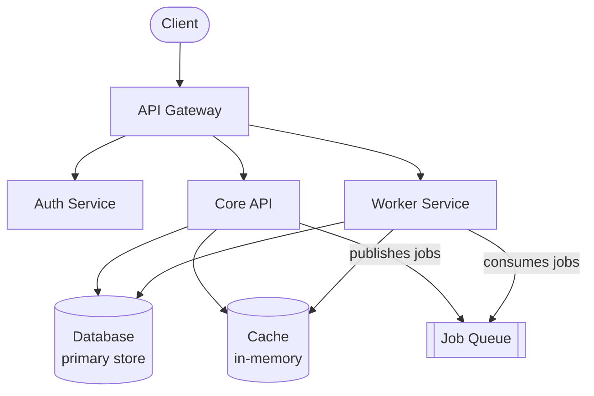

Esta página entrega um mapa de alto nível dos nossos serviços de backend. Cada serviço tem seu próprio README com documentação mais profunda.

## Mapa dos serviços

## Serviços

### API Gateway
Ponto de entrada público. Cuida de roteamento, rate limiting e checagens de autenticação antes de encaminhar requests para os serviços downstream. Deployado em [Platform].

**Repo:** `api-gateway`

### Auth Service
Gerencia identidade de usuário, sessões e permissões. Integra com o identity provider para SSO. Todas as decisões de autenticação são delegadas aqui — outros serviços chamam o Auth para validar tokens.

**Repo:** `auth-service`

### Core API
Backend principal da aplicação. Cuida da lógica de negócio do domínio principal do produto. É dono do banco de dados primário.

**Repo:** `core-api`

### Worker Service
Processa jobs em background: entrega de e-mail, processamento assíncrono de dados, tarefas agendadas e entrega de webhooks. Consome da fila de jobs.

**Repo:** `worker`

## Padrões de comunicação

- **Síncrono:** Os serviços se comunicam via APIs HTTP internas. Headers de autenticação são propagados e validados em cada borda de serviço.
- **Assíncrono:** Workers consomem da fila de jobs. A Core API publica jobs; os workers processam de forma independente.
- **Eventos:** Eventos significativos de domínio (usuário criado, assinatura alterada) são publicados no event bus para consumers downstream.

## Ambientes

| Ambiente | Propósito | Acesso |
|----------|-----------|--------|
| Local | Desenvolvimento | Todas as pessoas devs |
| Staging | Validação pré-produção | Todas as pessoas devs |
| Production | Tráfego real | Apenas via deploy tool |
